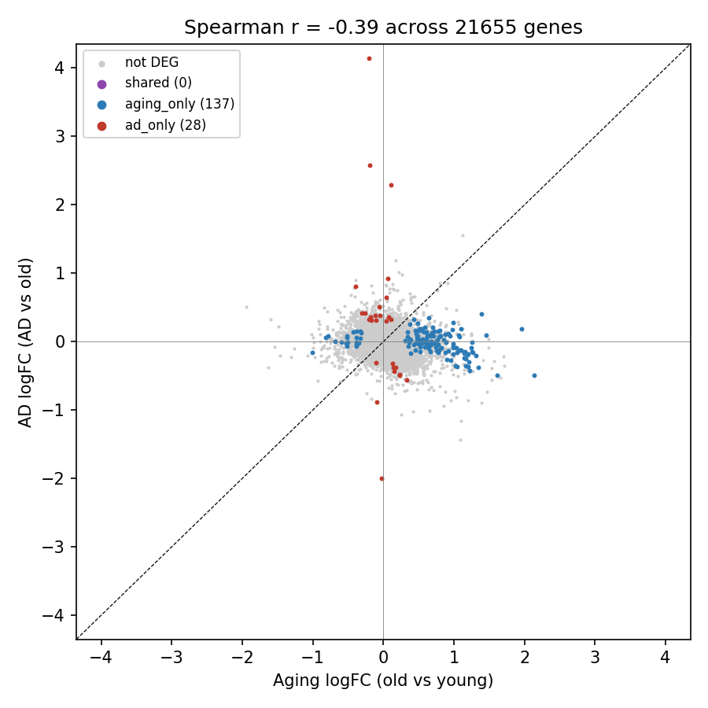
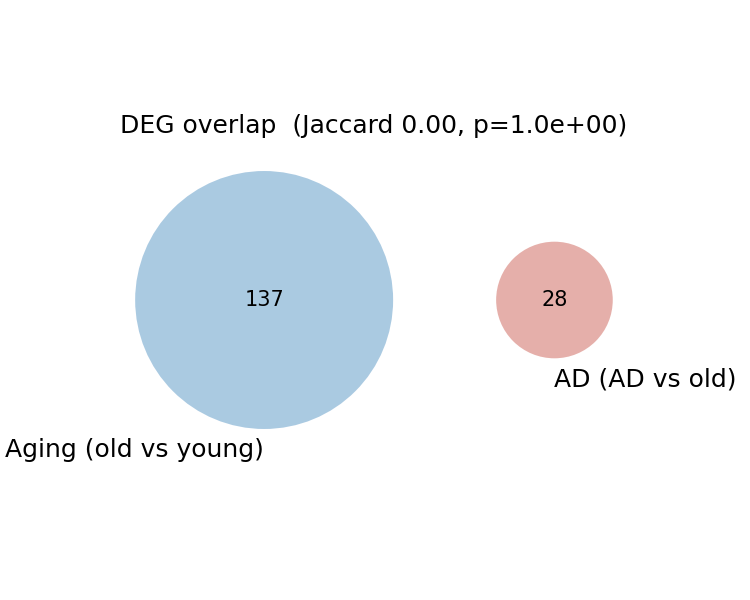
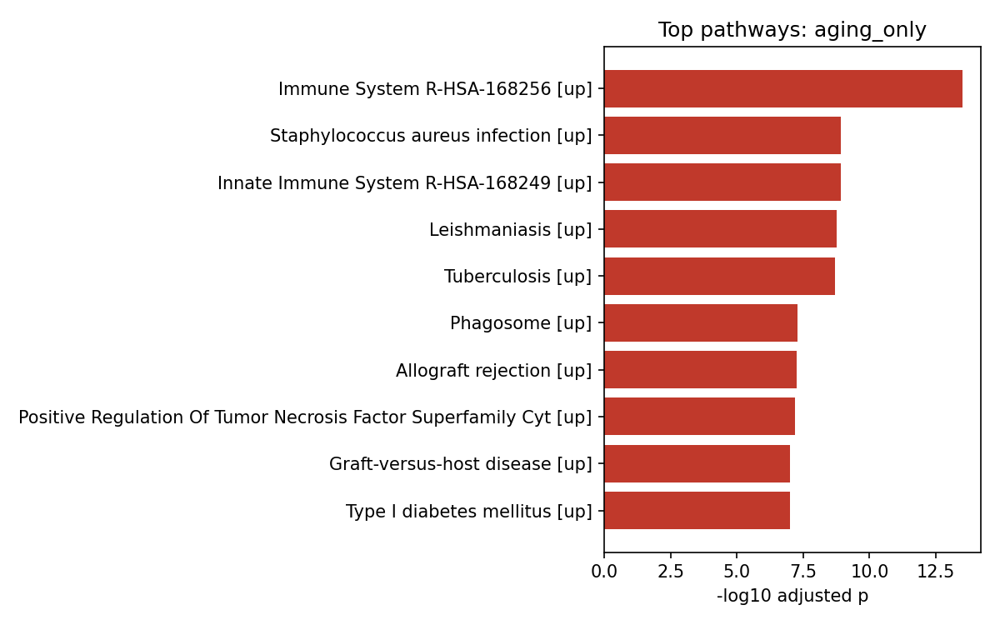
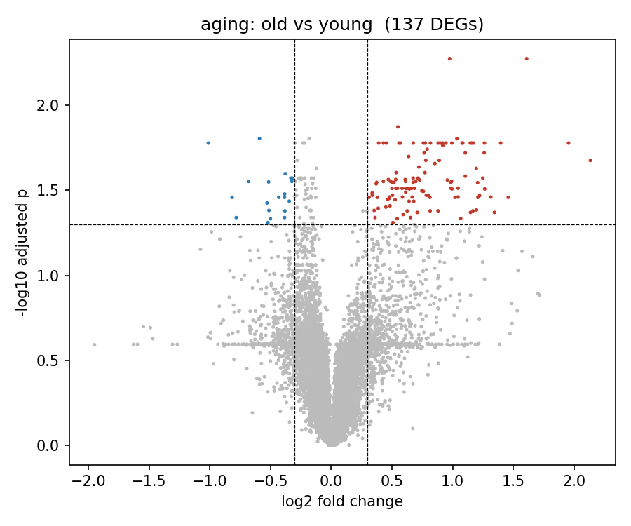
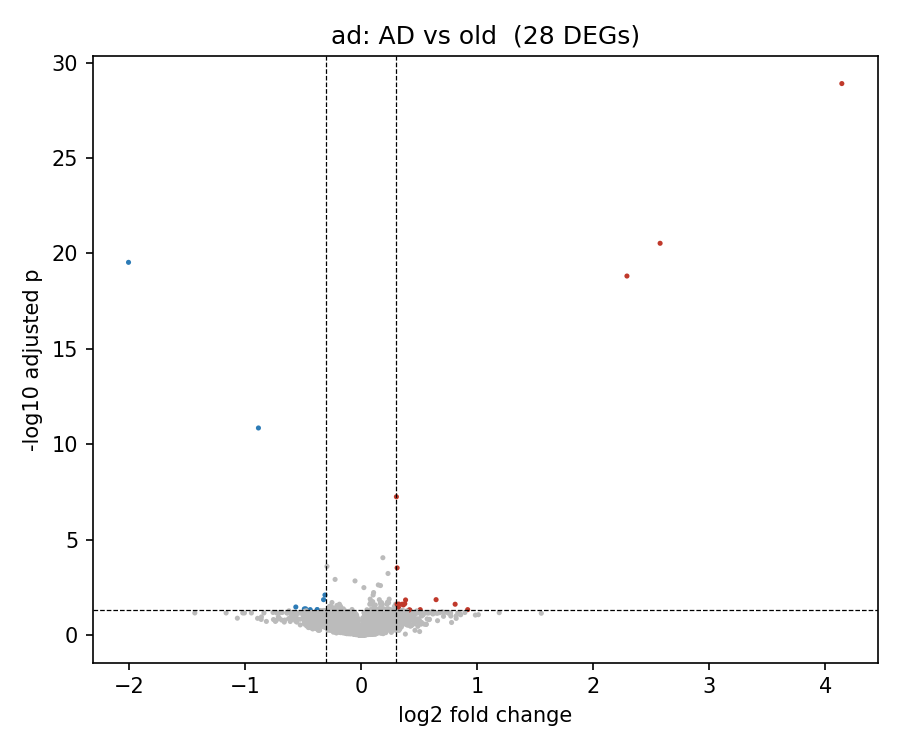
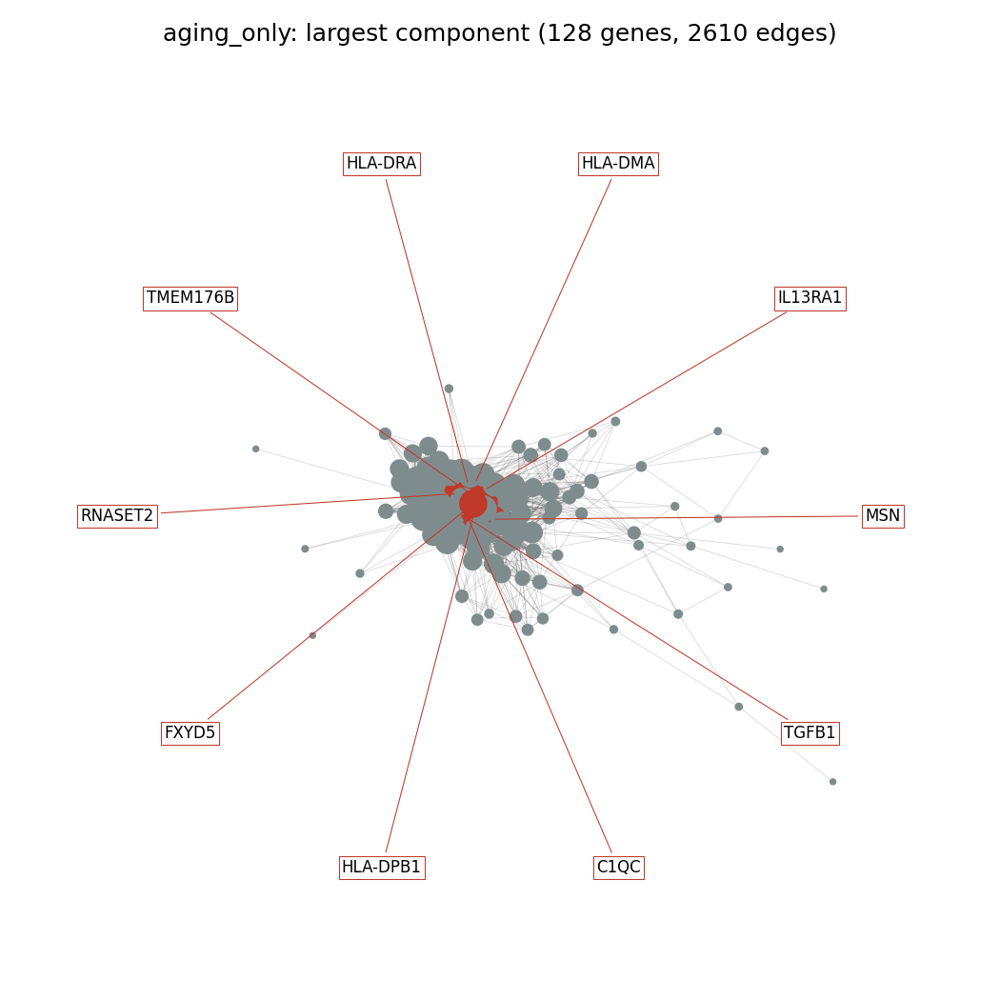

# Brain Aging vs Alzheimer's Disease: Comparative Transcriptomics

Is Alzheimer's disease (AD) simply brain aging running fast, or a molecularly distinct process? The answer matters clinically: if AD is accelerated aging, therapies that slow normal brain aging should help; if it is distinct, AD needs its own targets and biomarkers that normal aging does not share. This project compares two differential expression signatures from the same brain region — **aging** (old vs young healthy controls) and **AD** (AD vs old healthy controls) — and reports shared vs unique genes, pathways and co-expression hub genes.

## Quick start

Requires Python 3.10+.
**Windows (PowerShell)**

```powershell
py -3 -m venv .venv
.\.venv\Scripts\Activate.ps1
python -m pip install -r requirements.txt
python main.py --demo      # synthetic data, offline, a few seconds
python main.py             # GSE48350 hippocampus (downloads ~160 MB on first run)
```

If activation is blocked with "running scripts is disabled on this system", allow local scripts for your user once, then activate again:

```powershell
Set-ExecutionPolicy -Scope CurrentUser -ExecutionPolicy RemoteSigned
```

**Windows (Command Prompt)**

```bat
py -3 -m venv .venv
.venv\Scripts\activate.bat
python -m pip install -r requirements.txt
python main.py --demo
python main.py
```

**macOS / Linux**

```bash
python3 -m venv .venv
source .venv/bin/activate
python -m pip install -r requirements.txt
python main.py --demo
python main.py
```

Other options (same on every platform, run with the venv active):

```powershell
python main.py --region "entorhinal"   # another GSE48350 region
python main.py --gse GSE5281           # validation dataset (AD vs old only)
python main.py --string                # add STRING protein-interaction degree to hubs
```

Every step caches its output; delete a results folder to recompute it, e.g. in PowerShell:

```powershell
Remove-Item -Recurse -Force results\demo
```

(Command Prompt: `rmdir /s /q results\demo`; macOS/Linux: `rm -rf results/demo`.)

## What the pipeline does

1. **Load and label** — downloads the GEO series, parses region, age, sex and disease from free-text metadata, assigns `young` (<40), `old` (≥60) and `AD`, and collapses probes to genes.
2. **Differential expression** — per-gene OLS with sex as a covariate (Welch t-test if sex is missing), Benjamini–Hochberg FDR; DEG = FDR < 0.05 and |log2FC| > 0.3.
3. **Compare** — shared / aging-only / AD-only DEGs, concordant vs discordant direction, hypergeometric overlap test, Jaccard index, genome-wide Spearman correlation of logFC.
4. **Pathways** — Enrichr (GO BP 2023, KEGG 2021, Reactome 2022) on each set, split into up/down when both have ≥20 genes.
5. **Hub genes** — co-expression network per set (|Pearson r| ≥ 0.7), top 10 genes by degree.
6. **Report** — `report.md` with all numbers and a rule-based reading of the result.

## Output files

| File | What it is |
|---|---|
| `results/de_aging.csv` | Old vs young DE table (gene, logFC, means, t, p, adj p, DEG flag) |
| `results/de_ad.csv` | AD vs old DE table |
| `results/deg_sets.csv` | Every DEG with both logFCs, its set and concordant/discordant class |
| `results/comparison_stats.json` | Overlap counts, hypergeometric p, Jaccard, Spearman r |
| `results/enrichment_{set}.csv` | Enrichr terms per set (library, direction, adj p, overlap, genes) |
| `results/hubs.csv` | Top co-expression hubs per set with their aging and AD logFC |
| `results/report.md` | Auto-generated summary |
| `figures/volcano_*.png` | Volcano plots for each comparison |
| `figures/venn.png` | DEG overlap |
| `figures/logfc_scatter.png` | Aging logFC vs AD logFC for all genes |
| `figures/enrichment_{set}.png` | Top 10 pathways per set |
| `figures/network_{set}.png` | Co-expression network, hubs labeled |

Runs other than the default go to `results/<GSE>_<region>/` and `figures/<GSE>_<region>/`; the demo goes to `results/demo/`. Paths are shown with `/`; on Windows the same folders appear as `results\...` and `figures\...`.

## Example figures (GSE48350, hippocampus)

Aging vs AD fold changes across all genes:



| | |
|---|---|
|  |  |
|  |  |

Aging-only co-expression network:



## Limitations

- One brain region per run, one dataset per run.
- "Early AD" depends on each dataset's labels; most post-mortem AD cases are late-stage (Braak V–VI).
- Post-mortem tissue: agonal state, RNA quality and post-mortem interval are not modeled.
- Cell-type composition shifts (neuron loss, microglial activation) are not modeled and can drive bulk expression changes.
- In GSE48350 all AD arrays were submitted separately (2013) from the control arrays (2008), so AD vs old is confounded with batch. Treat the AD comparison from this dataset with caution.
- GSE48350 values are linear-scale and are transformed with log2(x + 1), which compresses fold changes for low-intensity values.
- Co-expression hubs are correlational, not causal.

## Data

- **GSE48350** — Berchtold NC, et al. *Synaptic genes are extensively downregulated across multiple brain regions in normal human aging and Alzheimer's disease.* Neurobiol Aging. 2013;34(6):1653–61.
- **GSE5281** — Liang WS, et al. *Gene expression profiles in anatomically and functionally distinct regions of the normal aged human brain.* Physiol Genomics. 2007;28(3):311–22; and Liang WS, et al. *Alzheimer's disease is associated with reduced expression of energy metabolism genes in posterior cingulate neurons.* PNAS. 2008;105(11):4441–6.
